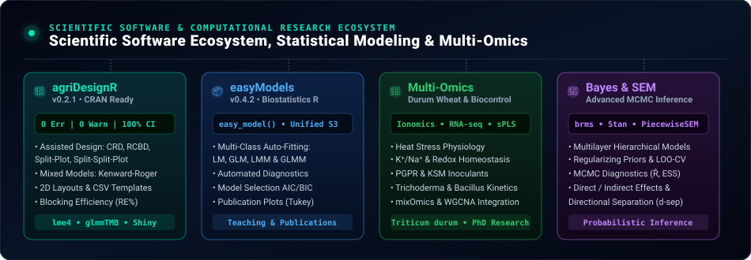

<!-- Header Dynamic Waving Banner -->

<!-- Dynamic Animated Typing Subtitle -->

 

<!-- Profile Metrics & Social Links -->

---

### 🔬 Multi-Omics & Plant Physiology Research Framework

  

 

- 🎓 **University Teaching (PUC):** Lecturer of the undergraduate course **Statistical Applications** (*Aplicaciones Estadísticas*) at the **Pontificia Universidad Católica de Chile**, training students in statistical inference, experimental design, linear models, and applied data analysis in R.
- 🌾 **PhD Research & Multi-Omics:** PhD Candidate in Plant Biotechnology (PUC), focused on abiotic stress tolerance (heat and drought) in crops through the integration of **Ionomics** ($K^+/Na^+$, micronutrients), **Transcriptomics** (RNA-seq / `DESeq2` / `WGCNA`), and **Metabolomics** (antioxidant profiling, compatible solutes, proline, MDA).
- 🦠 **Agricultural Microbiology & Biocontrol:** Quantitative modeling of plant-beneficial microbe interactions: antagonistic dynamics of ***Trichoderma* spp.** (mycoparasitism, volatile organic compounds VOCs, dual-culture inhibition), Plant Growth-Promoting Rhizobacteria (**PGPR**: *Bacillus*, *Pseudomonas*), dual inoculation/consortia, biomineral solubilization ($P$, $K$, siderophores), and microbe-mediated **abiotic stress mitigation**.
- 🎲 **Bayesian Statistics & MCMC Inference:** Advanced Bayesian hierarchical modeling with **`brms`** and **`Stan`**, calibration of informative and regularizing priors, MCMC convergence diagnostics ($\hat{R}$, ESS, trace plots), leave-one-out cross-validation (**LOO-CV / WAIC**), and Posterior Predictive Checks.
- 🕸️ **Structural Equation Modeling (Piecewise SEM):** Disentangling direct and indirect effects in multilayer physiological networks, integrating hierarchical mixed submodels and directional separation (*d-sep*) tests.
- 💻 **Scientific Software Development:** Creator and author of the R packages [**`agriDesignR`**](https://github.com/PALP31/agriDesignR) (v0.2.1, assisted experimental design engine, 2D micro-layouts, and hierarchical mixed models) and [**`easyModels`**](https://github.com/PALP31/easyModels) (v0.4.2, automated and reproducible biostatistics), designed to translate cutting-edge methodological workflows to the university classroom and high-impact scientific research.

---

### 🛠️ Tech Stack & Computational Tools

| Domain | Technologies & Libraries |
| :--- | :--- |
| **Languages** |     |
| **Bayesian Statistics & Modeling** |   `piecewiseSEM` `lme4` `glmmTMB` `mgcv (GAMs)` `brms` `bayesplot` `tidybayes` `drc` `emmeans` `DHARMa` |
| **Experimental Design** |  `agricolae` `emmeans` `desplot` `Alpha-Lattice` `Split-Plot` `RCBD` `Power Analysis` |
| **Multi-Omics & Bioinformatics** | `DESeq2` `mixOmics (sPLS-DA)` `WGCNA` `Bioconductor` `tidyverse` `ggplot2` `pheatmap` `ComplexHeatmap` |
| **Microbiome & Biocontrol** | `Dose-Response (drc)` `Dual-Culture Kinetics` `PhytoMicrobiome Stats` `Bioassays Phenotyping` |
| **Publishing & Reproducibility** |     |
| **Environments, IDEs & AI Agents** |       |
| **DevOps & Systems** |      |

---

### 🚀 Featured R Packages & Ecosystems

  

<table>
  <tr>
    <!-- 0. agriDesignR (NEW FEATURED PACKAGE) -->
    <td width="100%" colspan="2" valign="top">
      
      <h3><a href="https://github.com/PALP31/agriDesignR">🌱 agriDesignR (v0.2.1) — Assisted Experimental Design Engine & Mixed Models</a></h3>
      

        
        
        
        
        
        
      

      
Intelligent decision engine for agricultural and biological sciences. Connects the complete workflow: <strong>Pre-Trial Planning</strong> (greenhouse/field gradient diagnostics, replication calculator, 2D bench layouts, and sowing CSV templates), <strong>Multi-Engine Mixed Modeling</strong> (Kenward-Roger LMM, GLMM, non-parametric tests), <strong>Automated Diagnostic Remediation</strong> (Box-Cox, varIdent, Gamma/NB GLMM), <strong>Relative Blocking Efficiency</strong> (Cochran & Cox), <strong>Simple Effects in 2- & 3-Way Factorials</strong>, <strong>Publication-Ready Figures</strong> (Nature style), and an <strong>Interactive Web App</strong> (<code>launch_app()</code>).

      
<code>remotes::install_github("PALP31/agriDesignR@v0.2.1")</code>

    </td>
  </tr>

  <tr>
    <!-- 1. easyModels -->
    <td width="50%" valign="top">
      
      <h3><a href="https://github.com/PALP31/easyModels">📦 easyModels (v0.4.2)</a></h3>
      

        
        
      

      
R package for applied and reproducible biostatistics. Features a unified S3 architecture (<code>easy_model</code>), automated fitting for LM, GLM, LMM, and GLMM, standard experimental designs (RCBD, Split-Plot, Latin Square, Repeated Measures), automated assumption diagnostics (<code>verificar_supuestos</code>), model selection via AIC/BIC, and publication-ready plots with Tukey grouping letters.

    </td>
    <!-- 2. Plant-Microbiome-Biocontrol -->
    <td width="50%" valign="top">
      <h3><a href="https://github.com/PALP31/Plant-Microbiome-Biocontrol">🦠 Plant-Microbiome-Biocontrol</a></h3>
      

        
        
      

      
Platform for quantitative modeling and experimental analysis of plant-microbe interactions: <em>Trichoderma</em> antagonistic kinetics, plant growth-promoting rhizobacteria (PGPR: <em>Bacillus</em>, <em>Pseudomonas</em>), dual consortia, mineral solubilization ($P, K$), and mitigation mechanisms under salinity, drought, and heat stress.

    </td>
  </tr>
  <tr>
    <!-- 3. BioAgro-Stats -->
    <td width="50%" valign="top">
      <h3 align="center"><a href="https://github.com/PALP31/BioAgro-Stats">📊 BioAgro-Stats</a></h3>
      

        
        
      

      
Structured 8-module repository for advanced biostatistics: from assumption auditing, experimental designs, and non-linear dose-response curves (log-logistic DRC) to Bayesian modeling with <code>brms</code>, Machine Learning (Random Forest, XGBoost), and physiological PCA biplots.

    </td>
    <!-- 4. Triticum-tale-web -->
    <td width="50%" valign="top">
      <h3 align="center"><a href="https://github.com/PALP31/Triticum-tale-web">🌾 Triticum Tale Web</a></h3>
      

        
        
      

      
Scientific web portal and interactive Data Storytelling platform built with Quarto/Plotly to visually communicate multi-omics and physiological stress responses in <em>Triticum durum</em> under heat and drought stress.

    </td>
  </tr>
</table>

---

### 📋 Specialized Repositories & Research Ecosystems

| Repository | Specialty & Focus | Direct Link |
| :--- | :--- | :---: |
| **🌱 agriDesignR** | Assisted Experimental Design Engine, Mixed Models & Shiny GUI | [View Repository ↗](https://github.com/PALP31/agriDesignR) |
| **📦 easyModels** | R package for automated biostatistics and mixed models | [View Repository ↗](https://github.com/PALP31/easyModels) |
| **🦠 Plant-Microbiome-Biocontrol** | *Trichoderma*, PGPR, endophytes, biocontrol & abiotic stress mitigation | [View Repository ↗](https://github.com/PALP31/Plant-Microbiome-Biocontrol) |
| **📊 BioAgro-Stats** | Statistical modules for agronomy, DRC, GAMs & Machine Learning | [View Repository ↗](https://github.com/PALP31/BioAgro-Stats) |
| **🌾 Triticum-tale-web** | Interactive Quarto/Plotly platform for crop stress responses | [View Repository ↗](https://github.com/PALP31/Triticum-tale-web) |
| **📐 Experimental-Design-Lab** | RCBD, Split-Plot, Latin Squares, Alpha-Lattice & Power Analysis | [View Repository ↗](https://github.com/PALP31/Experimental-Design-Lab) |
| **📈 Statistical-Modeling-Mastery** | Progressive modeling roadmap: from LM/GLM to DRC, GAMs & Bayesian | [View Repository ↗](https://github.com/PALP31/Statistical-Modeling-Mastery) |
| **🌾 Plant-MultiOmics-Framework** | Ionomics, RNA-seq Transcriptomics, Metabolomics & sPLS-DA | [View Repository ↗](https://github.com/PALP31/Plant-MultiOmics-Framework) |
| **🎲 Bayesian-Biostats** | Bayesian Modeling with `brms`/`Stan`, MCMC & Piecewise SEM | [View Repository ↗](https://github.com/PALP31/Bayesian-Biostats) |

---

### 📊 Scientific Software Ecosystem & Development Metrics

  

 

  
  

---

  
  Pontificia Universidad Católica de Chile • University Teaching & Plant Biotechnology Research

