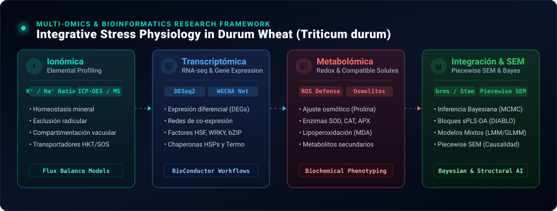

<!-- Header Dynamic Waving Banner -->

 

<!-- Profile Metrics & Social Links -->

---

### 🔬 Marco de Investigación Multi-Ómica & Fisiología Vegetal

  

 

- 🎓 **Docencia Universitaria (PUC):** Profesor del curso de pregrado **Aplicaciones Estadísticas** en la **Pontificia Universidad Católica de Chile**, formando a estudiantes en inferencia estadística, diseño experimental, modelos lineales y análisis de datos aplicados en R.
- 🌾 **Investigación Doctoral:** Estudiante de Doctorado en Biotecnología Vegetal (PUC), enfocado en la tolerancia a estrés abiótico (térmico e hídrico) en trigo candeal (*Triticum durum*) mediante **enfoques Multi-Ómicos (Ionómica, Transcriptómica y Metabolómica)** y **Fisiología Vegetal de Precisión**.
- 🎲 **Estadística Bayesiana & Inferencia MCMC:** Modelado jerárquico bayesiano avanzado con **`brms`** y **`Stan`**, calibración de *priors* informativos y regularizadores, diagnósticos rigurosos de convergencia de cadenas MCMC ($\hat{R}$, ESS, *trace plots*), validación predictiva cruzada (**LOO-CV / WAIC**) y chequeos predictivos posteriores (*Posterior Predictive Checks - PPC*).
- 🧬 **Enfoque Multi-Ómico & Bioinformática:** Integración computacional y bioestadística de capas de **Ionómica** ($K^+/Na^+$, micronutrientes), **Metabolómica** (perfiles antioxidantes, solutos compatibles, prolina, MDA) y **Transcriptómica** (RNA-seq / `DESeq2` / `mixOmics` / sPLS-DA).
- 📈 **Bioestadística & Modelado Avanzado:** Modelos Lineales Mixtos (LMM), Modelos Lineales Generalizados Mixtos (GLMM), Modelos Aditivos Generalizados (**GAMs** con `mgcv`), Curvas Dosis-Respuesta No Lineales (**DRC** / modelos log-logísticos LL.4), Diseños Experimentales (Split-Plot, RCBD, Cuadrados Latinos, Medidas Repetidas, Strip-Plot), **Machine Learning** (`tidymodels`, Random Forest, XGBoost, SVM), diagnósticos residuales avanzados con `DHARMa` y contrastes marginales `emmeans`.
- 💻 **Desarrollo de Software Científico:** Creador del paquete de R [`easyModels`](https://github.com/PALP31/easyModels), diseñado para transferir flujos estadísticos reproducibles tanto al aula universitaria como a la investigación científica de alto impacto.

---

### 🛠️ Stack Tecnológico & Herramientas

| Área | Tecnologías & Librerías |
| :--- | :--- |
| **Lenguajes** |     |
| **Estadística Bayesiana & Modelos** |   `lme4` `glmmTMB` `mgcv (GAMs)` `brms (Bayesiano)` `bayesplot` `tidybayes` `drc` `emmeans` `DHARMa` |
| **Multi-Ómica & Bioinformática** | `DESeq2` `mixOmics (sPLS-DA)` `Bioconductor` `tidyverse` `ggplot2` `pheatmap` `ComplexHeatmap` |
| **Machine Learning & Data Science** | `tidymodels` `xgboost` `randomForest` `scikit-learn` `scipy` `statsmodels` `pingouin` |
| **Publicación & Reproducibilidad** |     |
| **Entornos & DevOps** |      |

---

### 🚀 Paquetes y Ecosistemas Destacados

<table>
  <tr>
    <td width="50%" valign="top">
      
      <h3><a href="https://github.com/PALP31/easyModels">easyModels (v0.4.2)</a></h3>
      

        
        
      

      
Paquete de R para bioestadística aplicada y reproducible. Incluye arquitectura S3 unificada (<code>easy_model</code>), ajuste de LM, GLM, LMM y GLMM, diseños experimentales (RCBD, Split-Plot, Cuadrado Latino, Medidas Repetidas, Strip-Plot), verificación de supuestos (<code>verificar_supuestos</code>), selección de modelos con AIC/BIC (<code>comparar_modelos</code>) y figuras de publicación con letras de Tukey.

    </td>
    <td width="50%" valign="top">
      <h3 align="center"><a href="https://github.com/PALP31/BioAgro-Stats">📊 BioAgro-Stats</a></h3>
      

        
        
      

      
Repositorio estructurado en 8 módulos para bioestadística avanzada: desde auditoría de supuestos, diseños experimentales y modelos no lineales (DRC log-logísticos) hasta <strong>modelos bayesianos jerárquicos con <code>brms</code> y <code>Stan</code></strong>, Machine Learning (Random Forest, XGBoost) y PCA Biplots fisiológicos.

    </td>
  </tr>
  <tr>
    <td width="50%" valign="top">
      <h3 align="center"><a href="https://github.com/PALP31/Triticum-tale-web">🌾 Triticum Tale Web</a></h3>
      

        
        
      

      
Portal web científico y plataforma de Data Storytelling interactiva en Quarto/Plotly para comunicar visualmente las respuestas multi-ómicas y fisiológicas de <em>Triticum durum</em> ante estrés térmico e hídrico.

    </td>
    <td width="50%" valign="top">
      <h3 align="center"><a href="https://github.com/PALP31?tab=projects">📋 Gestión de Proyectos (GitHub Projects)</a></h3>
      

        
        
      

      
Tableros interactivos de gestión ágil (Kanban & Roadmaps) para coordinar la investigación doctoral multi-ómica, el roadmap de <code>easyModels</code> a CRAN y la planificación de cursos de pregrado en la PUC.

    </td>
  </tr>
</table>

---

### 📋 Tableros de Proyectos Activos (GitHub Projects)

| Proyecto | Enfoque | Tablero Interactivo |
| :--- | :--- | :---: |
| **🌾 Triticum Durum: Multi-Omics Pipeline** | Investigación doctoral en estrés térmico/hídrico, Ionómica, Transcriptómica y Metabolómica | [Ver Tablero Kanban ↗](https://github.com/users/PALP31/projects/1) |
| **📦 easyModels: Development Roadmap to CRAN** | Suite de pruebas, documentación y release v1.0.0 a CRAN | [Ver Tablero Kanban ↗](https://github.com/users/PALP31/projects/2) |
| **🏫 Bioestadística & Docencia PUC 2026** | Talleres prácticos 1-12, Quarto/Colab y proyecto final | [Ver Tablero Kanban ↗](https://github.com/users/PALP31/projects/3) |

---

### 📊 Actividad y Estadísticas en GitHub

  
  

    

  

---

  
  Pontificia Universidad Católica de Chile • Docencia Universitaria & Investigación en Biotecnología Vegetal

